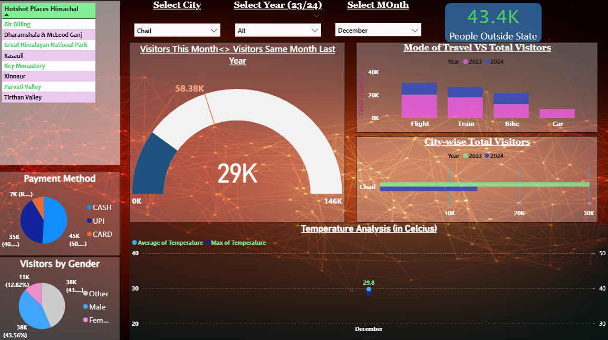
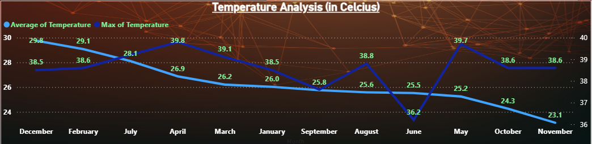

# Power-BI--Himachal-Travel--Project
Dashboard analysing travel trends using custom dataset

# 🌍 Travel Insights Dashboard – Power BI

This Power BI dashboard analyzes travel patterns across cities, months, and visitor demographics using custom datasets.

## 📊 Key Features

- Dynamic filters (city, month, gender)
- KPIs with YoY visitor comparisons
- Expense and weather-based trend analysis
- Visuals: bar, donut, map, area, scatter, gauge, etc.

## 📷 Dashboard Preview

## 🗂️ Files

| File                        | Description                      |
|-----------------------------|----------------------------------|
| `dashboard/Himachal Travel Dashboard.pbix` | Power BI dashboard file     |
| `ss1.png`     | Preview of the main dashboard    |
| `README.md`                 | Project overview                 |

## 🧠 Insights Derived

- Visitor trends by city and month  
- Travel modes and expenses by demographic  
- Weather's impact on tourism patterns
